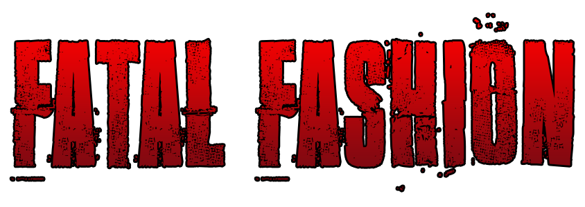

# 2016 Spring ScriptEd Hackathon
## Team Fatalis

### Synopsis

In light of the "STYLE" theme at this 2016 Spring ScriptEd Hackathon, the team
has decided to build a game which gives users the ability to customize various
aspects of the gameplay. These include the gender, skin color, clothing,
fighting style and weapons of their character. After customizing the character,
the user will be able to view their creation in the preview.

### Procedure
We started off designating different tasks to ensure that we would be able to
complete the project in the most efficient way possible.
The first set of tasks that we worked on was setting up the main page and 
designing sprites to suit our intent. We then worked on adjusting the sprites to
match each user input.

### Challenges
Some challenges that we faced included getting the options to function as desired,
completing the animations and also the time restriction prevented us from being
able to create the game portion of the project.

### Lessons/Skills Developed

### Upcoming

In the future, it is our intention to continue working on this project and
potentially get the animations to work and also allow the user to use their
creation to play a mini 2D platform fighting game.